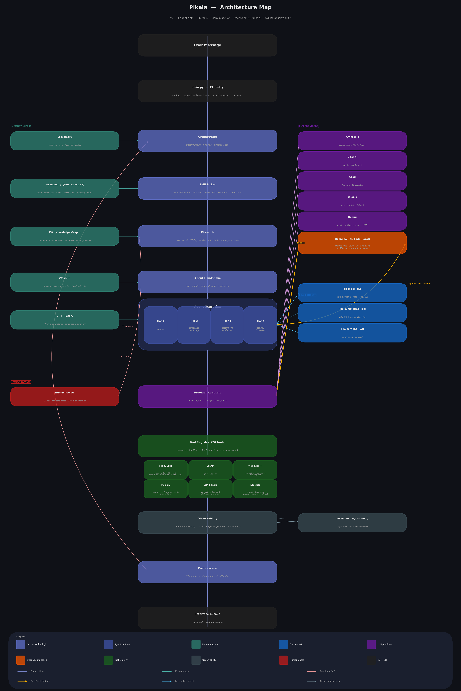

# Pikaia — Architecture Review

## System Architecture Map

*Full system flow: User input → CLI → Orchestrator → Skill Picker → Dispatch → Agent Handshake → Agent Execution (4 tiers) → Provider Adapters → Tool Registry → Observability → Post-process → Output.*

> **Regenerate:** `python generate_arch.py`

---

## Key Layers

| Layer | Files | Role |
|---|---|---|
| CLI & Entry | `main.py` | `--debug / --groq / --ollama / --deepseek / --project / --instance` flags; REPL loop |
| Orchestration | `Orchestrator.py`, `context_manager.py` | Intent classify, skill pick, context assembly, agent dispatch, post-process |
| Agent Runtime | `agent.py` | 4 tiers (atomic / composite / decompose+synthesise / council); ReAct tool loop; key rotation; compression |
| Memory | `mt_palace.py` | LT · MT MemPalace v2 (Wing/Room/Hall/Tunnel, recency decay, dedup, prune) · KG (temporal triples, contradiction detection) · CT · ST |
| Providers | `tools/providers/` | Anthropic · OpenAI · Groq · Ollama · DeepSeek-R1 1.5B (local, no key) · Debug |
| Tools | `tools/registry.py`, `tools/impl/*.py` | 26 tools; `ToolResult{success, data, error}` envelope; per-caller permissions |
| Observability | `db.py`, `metrics.py`, `trajectory.py` | SQLite WAL (`pikaia.db`): trajectories, tool_events, metrics |

---

## DeepSeek Fallback Path

When any primary provider fails (rate-limit exhausted, all keys rotated, network error):

1. `_tool_loop` / `_decompose` / `llm_call` catches the exception
2. `_try_deepseek_fallback()` lazy-loads `deepseek_local.Adapter`
3. Tries **Ollama** (`localhost:11434`, `deepseek-r1:1.5b`) first
4. Falls back to **HuggingFace transformers** if Ollama is unreachable
5. `<think>…</think>` blocks stripped from content; raw reasoning preserved in `resp["thinking"]`
6. Agent continues transparently — no task failure

Guard: skipped when `self._provider == "deepseek_local"` (prevents self-recursion when `--deepseek` mode is active).

Disable: `"deepseek_fallback_enabled": false` in `config.json`.

---

## Agent Tier Map

| Tier | Class | Use case |
|---|---|---|
| 1 | `Tier12Agent` | Atomic — single tool call expected |
| 2 | `Tier12Agent` | Composite — continuous multi-step loop |
| 3 | `Tier3Agent` | Decompose objective → step loop → synthesise |
| 4 | `Tier4Council` | 3 parallel specialist loops → council synthesis |

---

## MemPalace v2 Improvements

| Feature | Description |
|---|---|
| LanceDB backend | Columnar vector DB; `_JSONBackend` fallback if not installed |
| `_embed()` cache | Module-level singleton — one load per process |
| Halls layer | Memory-type corridors (facts / events / decisions / advice / issues) |
| L0 formalised | Top-3 LT entries + active project name, always prepended |
| Tunnel system | L2 queries expand across wings sharing the same room |
| Recency decay | Importance × `max(0.5, 1 − k·days/max_days)`; CORE entries exempt |
| KG contradiction | `add()` auto-invalidates same (subject, predicate) with different object |
| Dedup gate | Cosine 0.92 threshold against recent same-wing entries before write |
| Pruning | Archives importance < 0.30 entries older than 30 days (CORE exempt) |
| Input sanitisation | Strips `$(cmd)`, backtick substitution, null bytes; truncates at 8000 chars |
| Config-driven | All thresholds read from `config.json` — no hardcoded magic numbers |
| Batch embedding | `enrich_batch()` embeds + enriches multiple entries in one pass |

---

*For full module-level detail see [MAP.md](MAP.md). For setup instructions see [GETTING_STARTED.md](GETTING_STARTED.md).*
